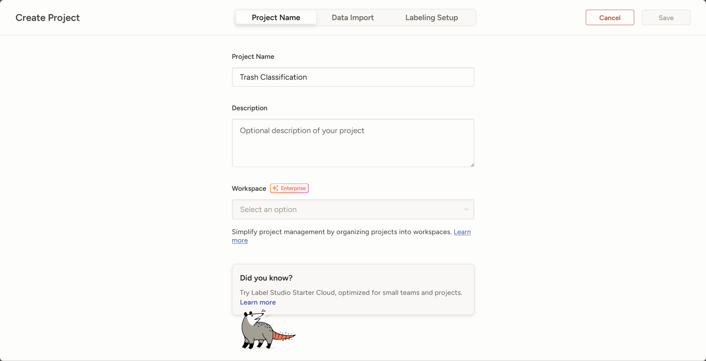
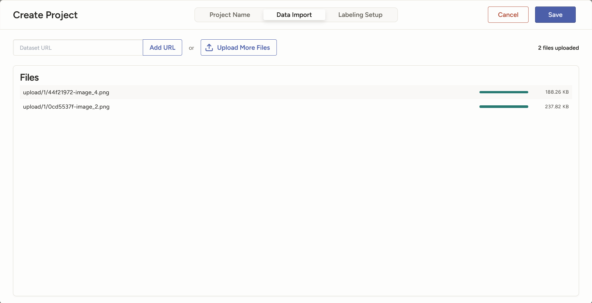
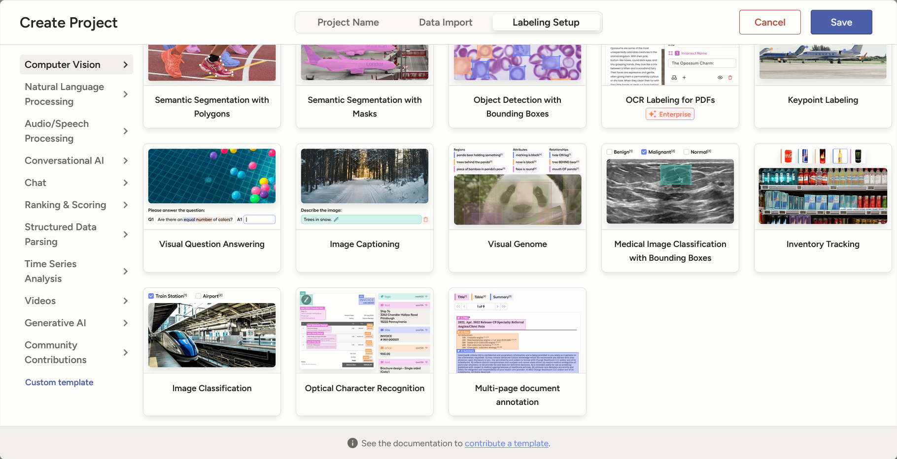
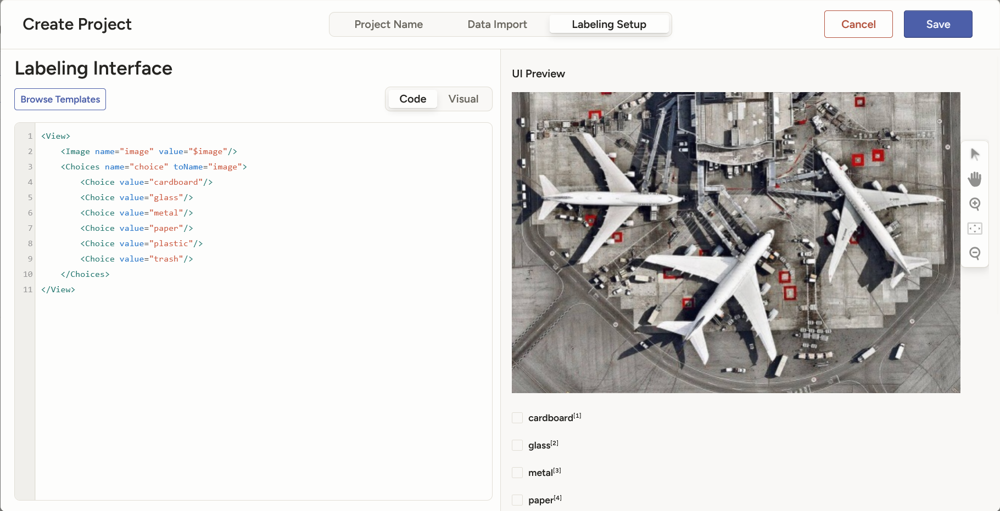
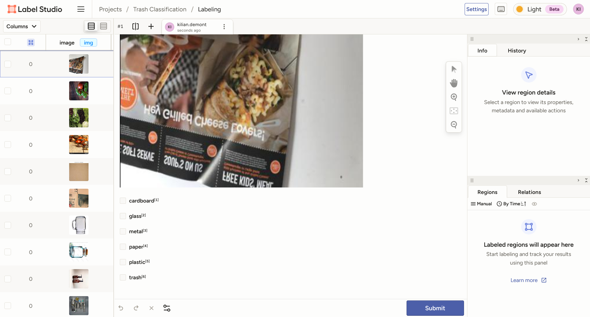
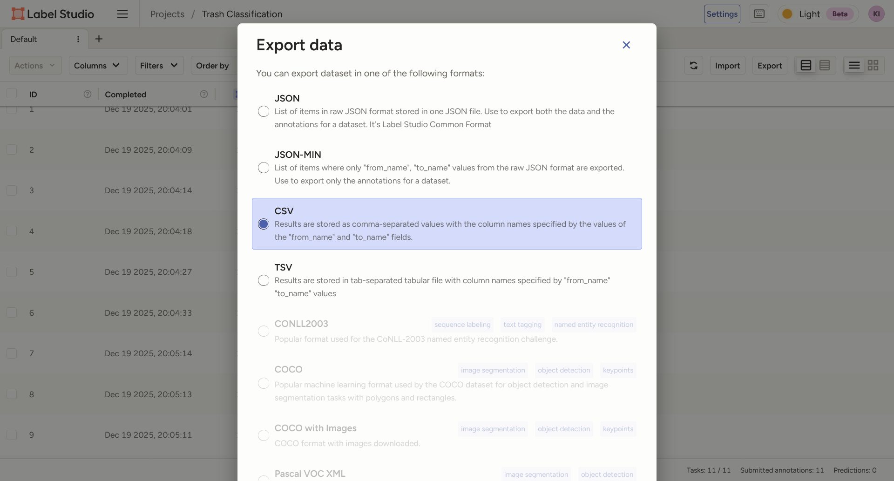

# ML Ops Project

Site de model evolution : https://cristhianarv.github.io/MLOps-project/

We will use uv to manage our virtual environment.

Install uv first 


Install dependencies with:
```bash
uv add -r requirements.txt
```

To activate the virtual environment, use:
```bash
source .venv/bin/activate
```

To deactivate the virtual environment, simply run:
```bash
deactivate
```

Create a freeze file to list dependencies with versions to reproduce the environment:
```bash
uv pip freeze > requirements-freeze.txt
```

To run the scripts of the project, use:
```bash
uv run src/prepare.py data/raw/ data/prepared
uv run src/train.py data/prepared/ model
uv run src/evaluate.py model/ data/prepared/
```

## Project Structure
```bash
> tree . -L 3
.
├── README.md
├── data
│   ├── prepared
│   │   ├── labels.json
│   │   ├── preview.png
│   │   ├── test
│   │   └── train
│   └── raw
│       ├── cardboard
│       ├── glass
│       ├── metal
│       ├── paper
│       ├── plastic
│       └── trash
├── evaluation
│   ├── metrics.json
│   └── plots
│       ├── confusion_matrix.png
│       ├── pred_preview.png
│       └── training_history.png
├── main.py
├── model
│   ├── history.npy
│   └── model.keras
├── notebook.ipynb
├── params.yaml
├── pyproject.toml
├── requirements-freeze.txt
├── requirements.txt
├── src
│   ├── evaluate.py
│   ├── prepare.py
│   ├── train.py
│   └── utils
│       ├── __init__.py
│       ├── __pycache__
│       └── seed.py
└── uv.lock

18 directories, 21 files
```

# DVC

Initialize DVC in the project with:
```bash
dvc init
```
You can activate the uv enviroment to use dvc commands.


Prepare stage for data preparation:
```bash
dvc stage add -n prepare \
    -p prepare \
    -d src/prepare.py -d src/utils/seed.py -d data/raw \
    -o data/prepared \
    uv run src/prepare.py data/raw data/prepared
```

The values of the parameters is prepare which includes all the prepare parameters referenced in the params.yaml file.

This stage has the src/prepare.py, the src/utils/seed.py and data/raw files as dependencies. If any of these files change, DVC will run the command python3.13 src/prepare.py data/raw data/prepared when using dvc repro.

The output of this command is stored in the data/prepared directory.

Train stage for model training:
```bash
dvc stage add -n train \
    -p train \
    -d src/train.py -d src/utils/seed.py -d data/prepared \
    -o model \
    uv run src/train.py data/prepared model
```

The values of the parameters is train which includes all the train parameters referenced in the params.yaml file.

This stage has the src/train.py, the src/utils/seed.py and data/prepared files as dependencies. If any of these files change, DVC will run the command uv run src/train.py data/prepared model when using dvc repro.

The output of this command is stored in the model directory.

Evaluate stage for model evaluation:
```bash
dvc stage add -n evaluate \
    -d src/evaluate.py -d model \
    --metrics evaluation/metrics.json \
    --plots evaluation/plots/confusion_matrix.png \
    --plots evaluation/plots/pred_preview.png \
    --plots evaluation/plots/training_history.png \
    uv run src/evaluate.py model data/prepared
```
This stage has the src/evaluate.py and the model files as dependencies. If any of these files change, DVC will run the command uv run src/evaluate.py model data/prepared when using dvc repro.

The script writes the model's metrics to evaluation/metrics.json, the confusion_matrix to evaluation/plots/confusion_matrix.png, the pred_preview to evaluation/plots/pred_preview.png and the training_history.png to evaluation/plots/training_history.png.

Visualize the pipeline with:
```bash
> dvc dag
+--------------+ 
| data/raw.dvc | 
+--------------+ 
        *        
        *        
        *        
  +---------+    
  | prepare |    
  +---------+    
        *        
        *        
        *        
    +-------+    
    | train |    
    +-------+    
        *        
        *        
        *        
  +----------+   
  | evaluate |   
  +----------+  
```

Important !!!

Execute the pipeline

Now that the pipeline is defined, you can execute it and reproduce the experiment with:
```bash
dvc repro
```

Compare changes in the pipeline with:
```bash
dvc params diff
```

And for metrics changes with:
```bash
dvc metrics diff
```
DVC displays the differences between HEAD and workspace, so you can easily compare the two iterations.


Generate a report with:
```bash
dvc plots diff --open
```
## Google Cloud Storage Backend for DVC

**Name du google project :** mlops-trash-classification

**Name du bucket :** mlops-cris-bucket 

Configure DVC to use a Google Storage remote bucket. The dvcstore is a user-defined path on the bucket. You can change it if needed:
```bash
dvc remote add -d data gs://mlops-cris-bucket/dvcstore
```

To get access to the GCS bucket
```bash
git clone <repo>

# Authenticate to GCP (their own Google account)
gcloud auth application-default login

# (optional) make ADC path explicit
export GOOGLE_APPLICATION_CREDENTIALS="$HOME/.config/gcloud/application_default_credentials.json"

# Pull the data/artifacts
dvc pull
```

## Set up  access to S3 bucket of the cloud provider
Si des erreurs avec gcloud faire cela avant:
Mettre dans le fichier .venv/bin/activate
```bash
# === Google Cloud & DVC integration ===
export CLOUDSDK_CONFIG="$HOME/.config/gcloud"
export GOOGLE_APPLICATION_CREDENTIALS="$HOME/.config/gcloud/application_default_credentials.json"
export BROWSER=/usr/bin/wslview
````


```bash
# Create the Google Service Account
gcloud iam service-accounts create google-service-account \
    --display-name="Google Service Account"

# Set the permissions for the Google Service Account
gcloud projects add-iam-policy-binding $GCP_PROJECT_ID \
    --member="serviceAccount:google-service-account@${GCP_PROJECT_ID}.iam.gserviceaccount.com" \
    --role="roles/storage.objectViewer"

# Create the Google Service Account Key
gcloud iam service-accounts keys create ~/.config/gcloud/google-service-account-key.json \
    --iam-account=google-service-account@${GCP_PROJECT_ID}.iam.gserviceaccount.com
```

## Serve and deploy the model
### Serve model locally with BentoML
To serve the model locally using FastAPI, run the following command:
```bash
bentoml serve --working-dir ./src serve:TrashClassifierService
```

This command starts a local server that hosts the model, allowing you to make predictions via API calls. You can access the API at localhost on the default port 3000.

```json
{
  "prediction": "metal",
  "probabilities": {
    "cardboard": 0.01749773882329464,
    "glass": 0.17597563564777374,
    "metal": 0.6514637470245361,
    "paper": 0.01539438683539629,
    "plastic": 0.10146550089120865,
    "trash": 0.03820298984646797
  }
}
```
`Wrong prediction the model need more training and a change of architecture.`

### Build and push model with BentoML and Docker locally

BentoML model artifact is described in a bentofile.yaml file. Now that the bentofile.yaml is created, we can serve the model with commands like:
```bash
bentoml serve --working-dir ./src 
``` 

#### Build the BentoML model artifact
Before containerizing the model, we need to build the BentoML model artifact using the following command:
```bash
> bentoml build src

Successfully built Bento(tag="trash_classifier:znbg2n6arwfxaaav").

Next steps: 

* Deploy to BentoCloud:
    $ bentoml deploy trash_classifier:znbg2n6arwfxaaav -n ${DEPLOYMENT_NAME}

* Update an existing deployment on BentoCloud:
    $ bentoml deployment update --bento trash_classifier:znbg2n6arwfxaaav ${DEPLOYMENT_NAME}

* Containerize your Bento with `bentoml containerize`:
    $ bentoml containerize trash_classifier:znbg2n6arwfxaaav 

* Push to BentoCloud with `bentoml push`:
    $ bentoml push trash_classifier:znbg2n6arwfxaaav 
```
### Containerize the BentoML model artifact with Docker
To containerize the BentoML model artifact using Docker, run the following command:
```bash
> bentoml containerize trash_classifier:latest --image-tag trash-classifier:latest

Successfully built Bento container for "trash_classifier:latest" with tag(s) "trash-classifier:latest"
To run your newly built Bento container, run:
    docker run --rm -p 3000:3000 trash-classifier:latest
```

`:latest` is the tag of the BentoML model artifact. It is a symlink to the latest version of the BentoML model artifact.

### Test the containerized BentoML model artifact locally

The BentoML model artifact is now containerized. To verify its behavior, serve the model artifact locally by running the Docker image:
```bash
docker run --rm -p 3000:3000 trash-classifier:latest
```

### Create a container registry
#### Enable the Google Artifact Registry API
```bash
# Enable the Google Artifact Registry API
gcloud services enable artifactregistry.googleapis.com
```

#### Create the Google Container Registry
Export the repository name as an environment variable. Replace <my_repository_name> with a registy name of your choice. It has to be lowercase and words separated by hyphens.
```bash
export GCP_CONTAINER_REGISTRY_NAME=mlops-trash-classification-registry
```

Export the repository location as an environment variable. You can view the available locations at Cloud locations. You should ideally select a location close to where most of the expected traffic will come from. Replace <my_repository_location> with your own zone. For example, use europe-west6 for Switzerland (Zurich):

```bash
export GCP_CONTAINER_REGISTRY_LOCATION=europe-west6
```

Lastly, when creating the repository, remember to specify the repository format as `docker`.
```bash
# Create the Google Container Registry
gcloud artifacts repositories create $GCP_CONTAINER_REGISTRY_NAME \
    --repository-format=docker \
    --location=$GCP_CONTAINER_REGISTRY_LOCATION

Create request issued for: [mlops-trash-classification-registry]
Waiting for operation [projects/mlops-trash-classification/locations/europe-west6/operations/2eca15a6-e354-4826-acae-131b5f3c97d0] to complete...done.                                                  
Created repository [mlops-trash-classification-registry].
```
### Login to the remote Container Registry

Authenticate with the Google Container Registry

Configure gcloud to use the Google Container Registry as a Docker credential helper.
```bash
# Authenticate with the Google Container Registry
gcloud auth configure-docker ${GCP_CONTAINER_REGISTRY_LOCATION}-docker.pkg.dev
```

Ensure your GCP_PROJECT_ID variable is still correctly exported:
```bash
# Check the exported project ID
echo $GCP_PROJECT_ID
```
if empty, re-export it:
```bash
gcloud projects list
export GCP_PROJECT_ID=mlops-trash-classification
```

Export the container registry host:
```bash
export GCP_CONTAINER_REGISTRY_HOST=${GCP_CONTAINER_REGISTRY_LOCATION}-docker.pkg.dev/${GCP_PROJECT_ID}/${GCP_CONTAINER_REGISTRY_NAME}
```
### Publish the BentoML model artifact Docker image to the container registry

### Error de push denied !!!
```bash
nano ~/.docker/config.json
{
  "credsStore": "desktop.exe",
  "auths": {
    "europe-west6-docker.pkg.dev": {}
  }
}
```

```bash
gcloud auth print-access-token | docker login \
  -u oauth2accesstoken \
  --password-stdin \
  https://europe-west6-docker.pkg.dev
```


The BentoML model artifact Docker image can be published to the container registry with the following commands:
```bash
# Tag the local BentoML model artifact Docker image with the remote container registry host
docker tag trash-classifier:latest $GCP_CONTAINER_REGISTRY_HOST/trash-classifier:latest

# Push the BentoML model artifact Docker image to the container registry
docker push $GCP_CONTAINER_REGISTRY_HOST/trash-classifier:latest
```
The image is now available in the container registry. You can use it from anywhere using Docker or Kubernetes.

Open the container registry interface on the cloud provider and check that the artifact files have been uploaded.

## Build and publish the model with BentoML and Docker in the CI/CD pipeline
In this chapter, you will containerize and push the model to the container registry with the help of the CI/CD pipeline.


### Set up access to the container registry of the cloud provider

The container registry will need to be accessed inside the CI/CD pipeline to push the Docker image.

Update the Google Service Account and its associated Google Service Account Key to access Google Cloud from the CI/CD pipeline without your own credentials.

```bash
# Set the Cloud Storage permissions for the Google Service Account
gcloud projects add-iam-policy-binding $GCP_PROJECT_ID \
    --member="serviceAccount:google-service-account@${GCP_PROJECT_ID}.iam.gserviceaccount.com" \
    --role="roles/storage.objectAdmin"

# Set the Artifact Registry permissions for the Google Service Account
gcloud projects add-iam-policy-binding $GCP_PROJECT_ID \
    --member="serviceAccount:google-service-account@${GCP_PROJECT_ID}.iam.gserviceaccount.com" \
    --role="roles/artifactregistry.createOnPushWriter"
```

### Add contrainer resgistry CI/CD secrets

Add the container registry secret to access the container registry from the CI/CD pipeline. Depending on the CI/CD platform you are using, the process will be different:

Create the following new variables by going to the Settings section from the top header of your GitHub repository. Select Secrets and variables > Actions and select New repository secret:
```bash
echo $GCP_CONTAINER_REGISTRY_HOST
```

### Update the CI/CD pipeline configuration file

You will adjust the pipeline to build and push the the docker image to the container registry.

## Deploy and access the model on Kubernetes
In this chapter, you will learn how to deploy the model on Kubernetes and access it from a Kubernetes pod using the previous Docker image.

This will allow the model to be used by other applications and services on a public endpoint accessible from anywhere.

### Create the kubernetes cluster

Create the Google Kubernetes cluster with the Google Cloud CLI.

Export the cluster name as an environment variable. Replace <my_cluster_name> with a cluster name of your choice. It has to be lowercase and words separated by hyphens.
```bash
export GCP_K8S_CLUSTER_NAME=mlops-trash-classification-cluster
export GCP_K8S_CLUSTER_ZONE=europe-west6-a
```

```bash
# Create the Kubernetes cluster
gcloud container clusters create \
    --machine-type=e2-standard-2 \
    --num-nodes=2 \
    --zone=$GCP_K8S_CLUSTER_ZONE \
    $GCP_K8S_CLUSTER_NAME

Default change: VPC-native is the default mode during cluster creation for versions greater than 1.21.0-gke.1500. To create advanced routes based clusters, please pass the `--no-enable-ip-alias` flag
Note: Your Pod address range (`--cluster-ipv4-cidr`) can accommodate at most 1008 node(s).
Creating cluster mlops-trash-classification-cluster in europe-west6-a... Cluster is being health-checked (Kubernetes Control Plane is healthy)...done.                                 
Created [https://container.googleapis.com/v1/projects/mlops-trash-classification/zones/europe-west6-a/clusters/mlops-trash-classification-cluster].
To inspect the contents of your cluster, go to: https://console.cloud.google.com/kubernetes/workload_/gcloud/europe-west6-a/mlops-trash-classification-cluster?project=mlops-trash-classification
CRITICAL: ACTION REQUIRED: gke-gcloud-auth-plugin, which is needed for continued use of kubectl, was not found or is not executable. Install gke-gcloud-auth-plugin for use with kubectl by following https://cloud.google.com/kubernetes-engine/docs/how-to/cluster-access-for-kubectl#install_plugin
kubeconfig entry generated for mlops-trash-classification-cluster.
NAME                                LOCATION        MASTER_VERSION      MASTER_IP      MACHINE_TYPE   NODE_VERSION        NUM_NODES  STATUS
mlops-trash-classification-cluster  europe-west6-a  1.33.5-gke.1201000  34.65.201.158  e2-standard-2  1.33.5-gke.1201000  2          RUNNING
```

### Validate kubectl can access the Kubernetes cluster
Validate kubectl can access the Kubernetes cluster:
```bash
kubectl get namespaces

NAME                          STATUS   AGE
default                       Active   32m
gke-managed-cim               Active   30m
gke-managed-system            Active   30m
gke-managed-volumepopulator   Active   30m
gmp-public                    Active   30m
gmp-system                    Active   30m
kube-node-lease               Active   32m
kube-public                   Active   32m
kube-system                   Active   32m
```
### Create the Kubernetes configuration files

In order to deploy the model on Kubernetes, you will need to create the Kubernetes configuration files. These files describe the deployment and service of the model.

Create a new directory called kubernetes in the root of the project, then create a new file called deployment.yaml in the kubernetes directory with the following content.

Replace the <docker_image> placeholder with the actual Docker image path:
```bash
sed -i "s|<docker_image>|$GCP_CONTAINER_REGISTRY_HOST/trash-classifier:latest|g" kubernetes/deployment.yaml
```

Create a new file called service.yaml

The deployment.yaml file describes the deployment of the model. It contains the number of replicas, the image to use, and the labels to use.

The service.yaml file describes the service of the model. It contains the type of service, the ports to use, and the labels to use.

### Deploy the containerised model on Kubernetes

To deploy the containerised Bento model artifact on Kubernetes, you will need to apply the Kubernetes configuration files.

```bash
# Apply the deployment
kubectl apply -f kubernetes/deployment.yaml

# Apply the service
kubectl apply -f kubernetes/service.yaml
```

### Access the model 

To access the model, you will need to find the external IP address of the service. You can do so with the following command:
```bash
kubectl describe services trash-classifier
Name:                     trash-classifier-service
Namespace:                default
Labels:                   <none>
Annotations:              cloud.google.com/neg: {"ingress":true}
Selector:                 app=trash-classifier
Type:                     LoadBalancer
IP Family Policy:         SingleStack
IP Families:              IPv4
IP:                       34.118.236.175
IPs:                      34.118.236.175
LoadBalancer Ingress:     34.65.233.6 (VIP)
Port:                     http  80/TCP
TargetPort:               3000/TCP
NodePort:                 http  30914/TCP
Endpoints:                10.120.0.5:3000
Session Affinity:         None
External Traffic Policy:  Cluster
Internal Traffic Policy:  Cluster
Events:
  Type    Reason                Age    From                Message
  ----    ------                ----   ----                -------
  Normal  EnsuringLoadBalancer  4m8s   service-controller  Ensuring load balancer
  Normal  EnsuredLoadBalancer   3m27s  service-controller  Ensured load balancer

```
The LoadBalancer Ingress field contains the external IP address of the service. In this case, it is 34.65.233.6

Try to access the model at the port 80 using the external IP address of the service. You should be able to access the FastAPI documentation page at http://<load balancer ingress ip>:80. In this case, it is http://34.65.233.6:80.

## Continuous deployment of the model with the CI/CD pipeline

In this chapter, you will deploy the model to the Kubernetes cluster with the help of the CI/CD pipeline. You will use Kubernetes to deploy the model to the cluster and the pipeline to trigger the deployment.

### Set up access to the Kubernetes cluster of the cloud provider
The Kubernetes cluster will need to be accessed inside the CI/CD pipeline to deploy the Docker image.

Update the Google Service Account and its associated Google Service Account Key to access Google Cloud from the CI/CD pipeline without your own credentials.

```bash
# Set the Kubernetes Cluster permissions for the Google Service Account
gcloud projects add-iam-policy-binding $GCP_PROJECT_ID \
    --member="serviceAccount:google-service-account@${GCP_PROJECT_ID}.iam.gserviceaccount.com" \
    --role="roles/container.developer"
```
### Add Kubernetes CI/CD secrets

Add the Kubernetes secrets to access the Kubernetes cluster from the CI/CD pipeline. Depending on the CI/CD platform you are using, the process will be different:

Create the following new variables by going to the Settings section from the top header of your GitHub repository. Select Secrets and variables > Actions and select New repository secret:

* GCP_K8S_CLUSTER_NAME: The name of the Kubernetes cluster (ex: mlops-surname-cluster, from the variable GCP_K8S_CLUSTER_NAME in the previous chapters)
* GCP_K8S_CLUSTER_ZONE: The zone of the Kubernetes cluster (ex: europe-west6-a for Zurich, Switzerland, from the variable GCP_K8S_CLUSTER_ZONE in the previous chapters)
Save the variables by selecting Add secret.

### Update the CI/CD pipeline configuration file

You will adjust the pipeline to deploy the model to the Kubernetes cluster.

### Access the model
You can access the new model at the same URL as before. The model should be updated with the latest version.
```bash
# Get the description of the service
kubectl describe services trash-classifier
```

## Use a self-hosted runner for the CI/CD pipeline
### Create a self-hosted runner container image
Jobs in a CI/CD workflow are executed on applications known as runners. These can be physical servers, virtual machines (like the default runner used for our workflow so far), or container images, and may operate on a public cloud or on-premises within your own infrastructure.

We will create a custom Docker container image for a self-hosted runner, store it in the Container Registry and deploy it on our Kubernetes cluster. An instance of this runner will then listen for jobs from GitHub Actions and execute them.

This container image will include all the necessary dependencies to run the workflows.

> Note : For our self-hosted Docker image storage, we opted to use the GitHub Container Registry because of its close integration with our existing GitHub environment. This decision allows us to restrict our CI/CD processes to the GitHub infrastructure while also demonstrating its use. However, we could have also used our existing Google Cloud Container Registry.

### Authenticate with the GitHub Container Registry

Before proceeding, you will need to create a personal access token. This token will be used to authenticate you on the GitHub Container Registry, allowing you to push the image there.

Follow the Managing Personal Access Token - GitHub docs guide to create a personal access token (classic) named GHCR_PAT with the write:package scope.

Export your token in as a variable. Replace<my_personal_access_token> with your own token.

```bash
export GHCR_PAT=<my_personal_access_token>
```

Authenticate to the Container Registry. Replace <my_username> with your own username.
```bash
echo $GHCR_PAT | docker login -u <my_username> ghcr.io --password-stdin
Login Succeeded
```
### Build and push the image to the container regsitry

With the entrypoint script ready, we can now build the Docker image before pushing it to the Container Registry.

To build the docker image, navigate to the docker folder and run the following command. Make sure to adjust the my_username and my_repository_name variables in the tag of the Docker image to match your own your own GitHub username and repository name.
```bash
docker build --platform=linux/amd64 --tag ghcr.io/cristhianarv/mlops-project/github-runner:latest .
```

> Note : Please note that the `--platform` parameter is important to set if your machine does not use the x86_64 architecture (like Apple Silicon). This is necessary because the runner, on which the Docker image will be deployed, operates on a 64-bit Linux environment.

Push the docker image to the GitHub Container Registry:
```bash
docker push ghcr.io/cristhianarv/mlops-project/github-runner:latest

The push refers to repository [ghcr.io/cristhianarv/mlops-project/github-runner]
81db81ccae0b: Pushed 
1773f1dacf1e: Pushed 
9da2846baa01: Pushed 
c8dbbb74dcfc: Pushed 
d4089e8b95ec: Pushed 
db4dd8fe9cf1: Pushed 
e03f228989eb: Pushed 
fb01f76d8765: Pushed 
73974f74b436: Pushed 
latest: digest: sha256:3abcc4e22df597d49c3e2cccb29fc872bb9d648753fdf7a055c17cc7fe35ebef size: 2209
```

### Adjust image visibility

Make sure to set the image visibility to Public in the GitHub Container Registry settings.

In your repository page, click on Packages on the right hand side, then on your github-runner package. In Package settings in the Danger Zone section, choose Change package visibility and set the package to public.

### Configure security

It is important to understand that using a self-hosted runner allows other users to execute code on your infrastructure. Specifically, forks of your public repository will trigger the workflow when a pull request is created.

Consequently, other users can potentially run malicious code on your self-hosted runner machine by executing a workflow.

While our self-hosted runner will be set up in a containerized, isolated environment that limits the impact of any malicious code, unwanted pull requests in forks could still exhaust the computational resources for which you are responsible.

To mitigate these risks, it is advisable to secure your runner by disabling workflow triggers by forks. In the repository, go to Settings > Actions > General.

* If your repository is public: In the Approval for running fork pull request workflows from contributors section, ensure the Require approval for all external contributors option is selected and click on Save.

* If your repository is private: In the Fork pull request workflows section, ensure the Run workflows from fork pull requests checkbox is disabled and click on Save.

### Set the self-hosted runner

We will now deploy our self-hosted GitHub runner to our Kubernetes cluster with the help of a YAML configuration file. As a reminder, the runner is used to execute the GitHub Action workflows defined in the repository.

The runner will use the custom Docker image that we pushed to the GitHub Container Registry. This image is identified by the label named GITHUB_RUNNER_LABEL which is set to the value base-runner.

### Add Kubeconfig secret
To enable the registration of the self-hosted runner, authentication via a secret is required. Initially, you need to generate a Personal Access Token (PAT) to authenticate with the GitHub repository. This token will subsequently be used to create a secret, allowing the use of the kubectl command on your machine.

Export your token in as a variable. Replace <my_repository_token> with your own token
```bash
export GH_RUNNER_PAT=<my_repository_token>
```

Run the following command to create the secret:
```bash
kubectl create secret generic github-runner-pat --from-literal=token=$GH_RUNNER_PAT

secret/github-runner-pat created
```

The created secret is stored within the Kubernetes cluster itself. As such, the secret is securely kept within the cluster and can be accessed by Kubernetes components running in that cluster.

### Deploy the runner

To deploy the runner to the Kubernetes cluster, run the following command:
```bash
kubectl apply -f kubernetes/runner.yaml
```

This will deploy a GitHub runner pod named github-runner in your current Kubernetes namespace. The runner will automatically register itself to the repository.

You can check the status of the pod with the following command:
```bash
kubectl get pods

NAME                                           READY   STATUS    RESTARTS   AGE
github-runner                                  1/1     Running   0          63s
trash-classifier-deployment-786647b97f-txl2l   1/1     Running   0          134m
```

You can connect to the pod once it is running with:
```bash
kubectl exec -it github-runner -- bash
```

You can then check the runner logs with:
```bash
tail -f run.log

√ Connected to GitHub

Current runner version: '2.329.0'
2025-11-15 01:22:26Z: Listening for Jobs
```

Exit the process by pressing Ctrl+C in the terminal, then exit the pod by entering exit.


In addtion, in Settings > Actions > Runners, you should now be able to see the github-runner runner listed with the Idle status.

> Note: To remove the runner from the Kubernetes cluster, run the following command:
```bash
kubectl delete -f kubernetes/runner.yaml
```
The runner will also automatically be unregistered from the repository.

### Update the CI/CD configuration file

You will now update the CI/CD configuration file to initiate a runner on the Kubernetes cluster, which will be responsible for training the model. The trained model will be uploaded to the remote bucket using DVC, making it available for publishing and deployment.

Additionally, since the experiment is now being trained directly from the CI/CD pipeline, the workflow will be modified to automatically push the results to the remote storage using DVC and to commit the updated lock file to the repository automatically.

As a result, when proposing changes to the model files in a branch, you no longer need to rundvc repro locally before pushing the changes with git push. After proposed changes are integrated into the main branch, you can obtain the updated dvc.lock file and model by using git pull and dvc pull.

## Train the model on a Kubernetes pod

You can now train your model on the cluster. However, some experiments may require specific hardware to run. For instance, training a deep learning model might require a GPU. This GPU could be shared among multiple teams for different purposes, so it is important to avoid monopolizing its use.

Display the nodes names and labels
```bash
kubectl get nodes --show-labels
```

Export the name of the two nodes as environment variables. Replace the <my_node_1_name> and <my_node_2_name> placeholders with the names of your nodes (gke-mlops-surname-cluster-default-pool-d4f966ea-8rbn and gke-mlops-surname-cluster-default-pool-d4f966ea-p7qm in this example).

```bash
export K8S_NODE_1_NAME=gke-mlops-trash-classifi-default-pool-c2319d15-6wq6
export K8S_NODE_2_NAME=gke-mlops-trash-classifi-default-pool-c2319d15-cq1m
```
### Labelize the nodes

You can now labelize the nodes to be able to use the GPU node for the training of the model.
```bash
# Labelize the nodes
kubectl label nodes $K8S_NODE_1_NAME gpu=true
kubectl label nodes $K8S_NODE_2_NAME gpu=false
```

You can check the labels with the kubectl get nodes --show-labels command. You should see the node with the gpu=true/ gpu=false labels.

### Adjust the self-hosted runner label

The existing self-hosted runner will not be used for model training. Instead, it will function as a "base runner," dedicated to monitoring jobs and creating on-demand specialized pods for training the model with GPU support.

To ensure the base runner operates effectively in this role, update its YAML configuration to prevent it from using the GPU-enabled node, as this is not required for its purpose. This change will also help keep the hardware resources available for the training job.

Note the nodeSelector field that will select a node with a gpu=false label.

To update the runner on the Kubernetes cluster, run the following commands:
```bash
kubectl delete pod github-runner
kubectl apply -f kubernetes/runner.yaml
```
The existing pod will be terminated, and a new one will be created with the updated configuration.

### Set self-hosted GPU runner
We will now create a similar configuration file for the GPU runner, which is used exclusively during the train and report steps of the workflow to create a self-hosted GPU runner specifically for executing this step.

The runner will use the same custom Docker image that we pushed to the GitHub Container Registry. This image is identified by the label GITHUB_RUNNER_LABEL which is set to the value gpu-runner.

Create a new file called runner-gpu.yaml in the kubernetes directory with the following content. Replace <my_username> and <my_repository_name> with your own GitHub username and repository name.

Note the nodeSelector field that will select a node with a gpu=true label.

### Add Kubeconfig secret

To enable the GPU runner to access the cluster, authentication is required. To obtain the credentials for your Google Cloud Kubernetes cluster, you can execute the following command to set up your kubeconfig file (~/.kube/config) with the necessary credentials:
```bash
# Get Kubernetes cluster credentials
gcloud container clusters get-credentials $GCP_K8S_CLUSTER_NAME --zone $GCP_K8S_CLUSTER_ZONE
```
This updates the kubeconfig file (~/.kube/config) used by kubectl with the necessary information to connect to your Google Cloud Kubernetes cluster.

Display the content of the ~/.kube/config file:
```bash
# Display the kubeconfig file
cat ~/.kube/config
```

### Add Kubernetes CI/CD secrets
Add the Kubernetes secrets to access the Kubernetes cluster from the CI/CD pipeline. Depending on the CI/CD platform you are using, the process will be different:

Create the following new variable by going to the Settings section from the top header of your GitHub repository. Select Secrets and variables > Actions and select New repository secret:

GCP_K8S_KUBECONFIG: The content of the ~/.kube/config file of the Kubernetes cluster.
Save the variables by selecting Add secret.

Save the variables by selecting Add secret.

### Update the CI/CD configuration file

You'll now update the CI/CD configuration file to start a runner on the Kubernetes cluster. Using the labels defined previously, you'll be able to start the training of the model on the node with the GPU.

Update the .github/workflows/mlops.yaml file.

When creating pull requests:

*  the setup-runner job creates a self-hosted GPU runner.
*  the train-and-report job runs on the self-hosted GPU runner. It trains the model and pushes the trained model to the remote bucket with DVC.
*  the cleanup-runner job destroys the self-hosted GPU runner that was created. It also guarantees that the GPU runner pod is removed, even when if the previous step failed or was manually cancelled.

When merging pull requests:

* the publish-and-deploy runs on the main runner when merging pull requests. It retrieves the model with DVC, containerizes then deploys the model artifact.

# Label Studio

##  Run with Docker

To avoid version conflicts, run Label Studio with Docker by following these steps:

```bash
docker pull heartexlabs/label-studio:latest
docker run -it -p 8080:8080 -v $(pwd)/mydata:/label-studio/data heartexlabs/label-studio:latest
```

Alternatively, you can run the following command to create a fresh mydata directory with the appropriate permissions before starting Label Studio:

```bash
rm -rf $(pwd)/mydata && mkdir -p $(pwd)/mydata && chmod 777 $(pwd)/mydata && docker run -it -p 8080:8080 -v $(pwd)/mydata:/label-studio/data heartexlabs/label-studio:latest
```

You can find all the generated assets, including SQLite3 database storage label_studio.sqlite3 and uploaded files, in the ./mydata directory.

## Configure

1. Create or connect you to your account on Label Studio.

2. Create a new project, for example named "Trash Classification".



3. Select the **Data Import** tab and click on the Upload File button. Select all the images from the uncertain_images folder.



4. Select the **Labeling Setup** tab and choose Image Classification under the Computer Vision menu.



5. Under Labeling Interface select Code and paste the following configuration:

```bash
<View>
    <Image name="image" value="$image"/>
    <Choices name="choice" toName="image">
        <Choice value="cardboard"/>
        <Choice value="glass"/>
        <Choice value="metal"/>
        <Choice value="paper"/>
        <Choice value="plastic"/>
        <Choice value="trash"/>
    </Choices>
</View>
```


6. Click on Save in the top right corner.

## Labeling

1. Go to the **Labeling** tab.

2. Start labeling the images by selecting the appropriate class for each image.



3. Export the labeled data by clicking on the Export button in the top right corner and selecting csv format.

